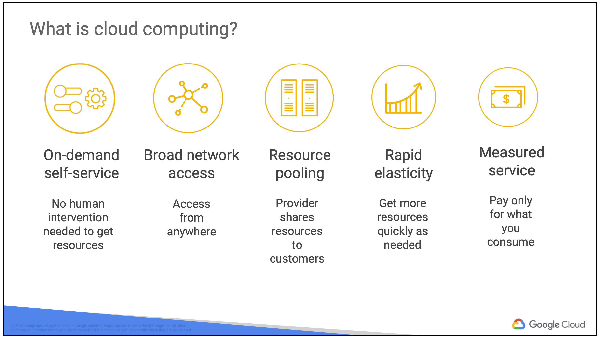
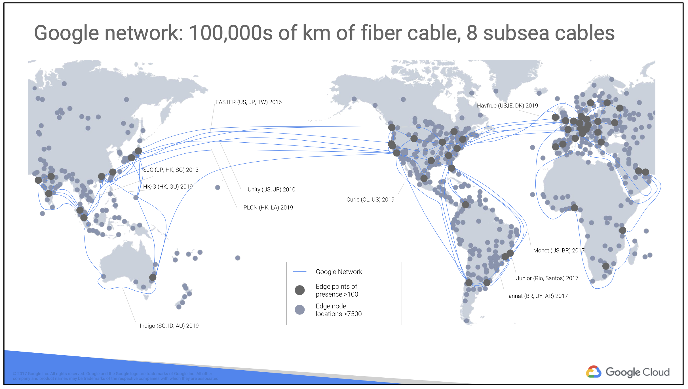
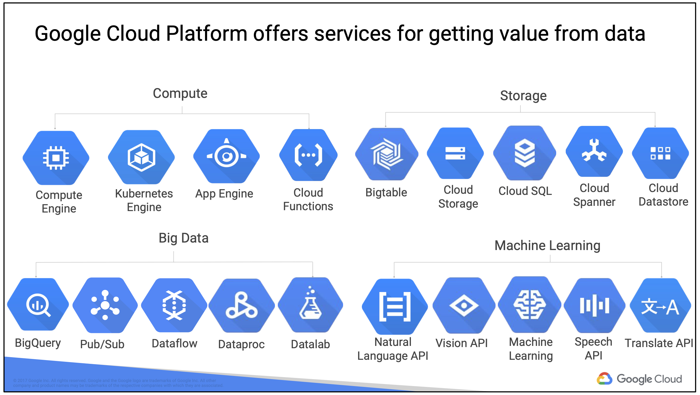
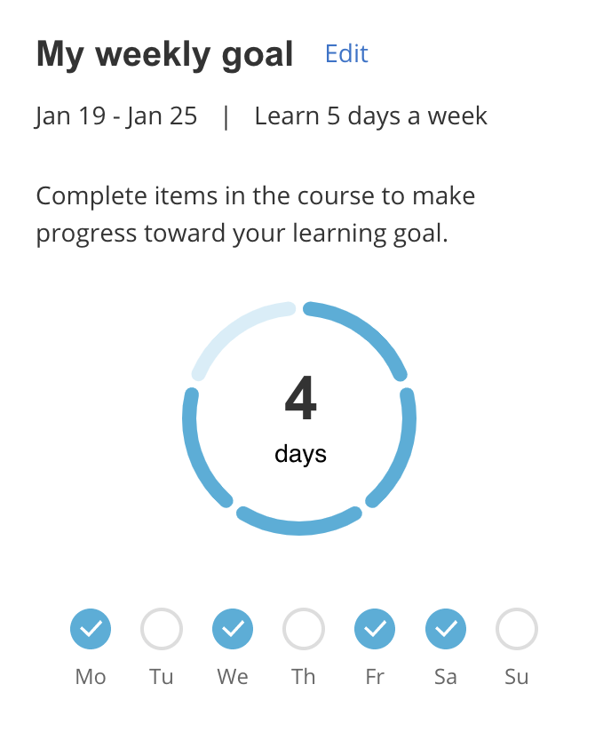
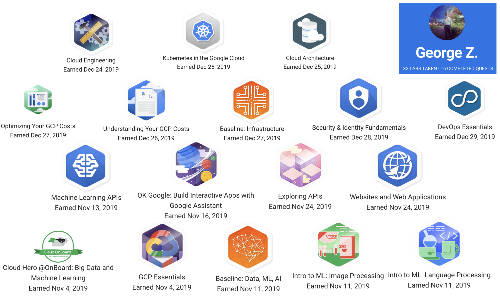
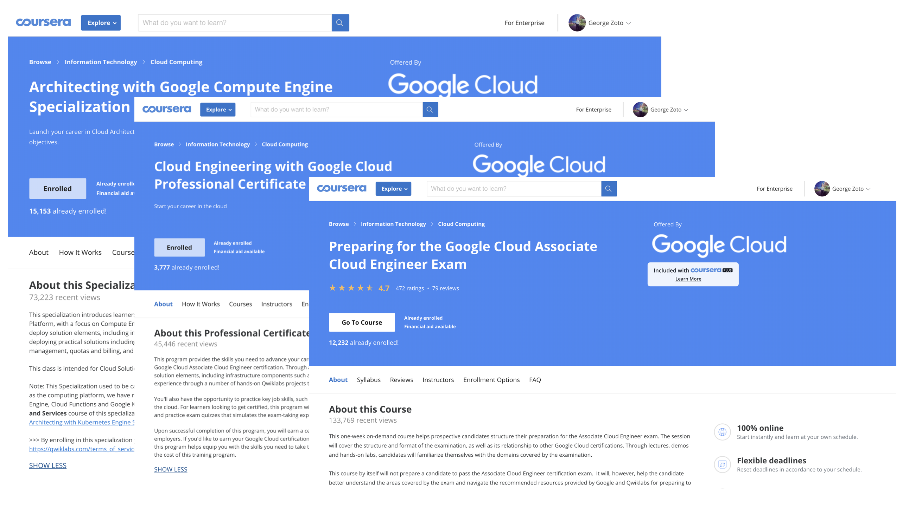
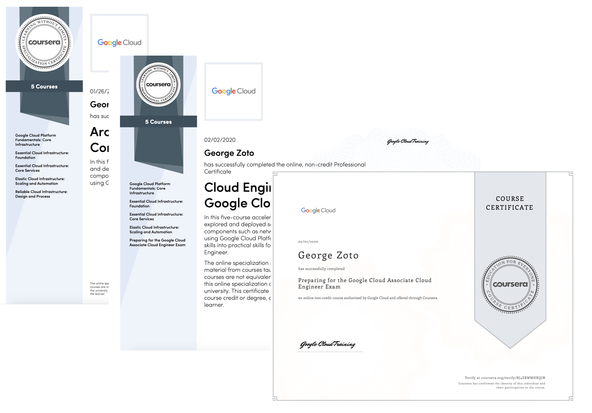
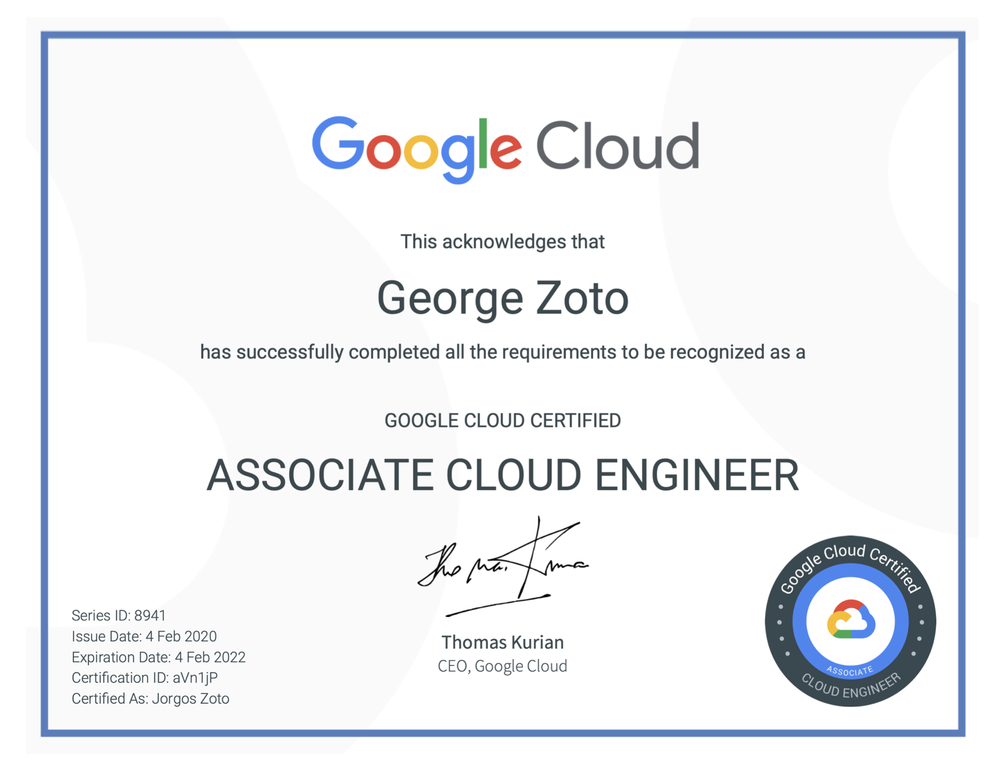
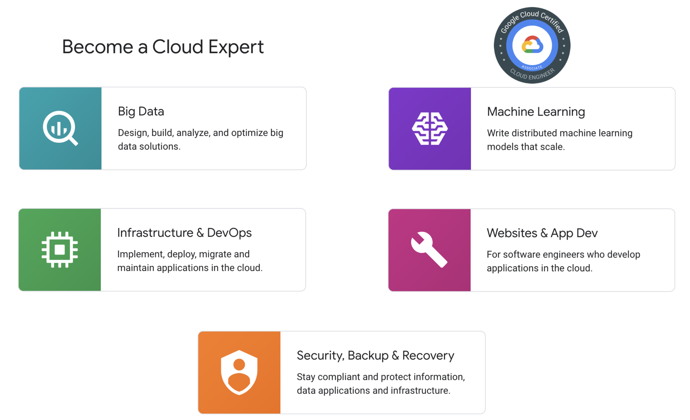

# Google Cloud Platform - Associate Cloud Engineer

Google Cloud Associate Engineer repository on my journey to becoming a cloud expert. Feel free to take a look at the resources I used under the Links section. The ACE exam covers the following topics:
1. Setting up a cloud solution environment
2. Planning and configuring a cloud solution
3. Deploying and implementing a cloud solution
4. Ensuring successful operation of a cloud solution
5. Configuring access and security

#googlecloudplatform #gcp #associatecloudengineer #googlecloudcertified #businesschallenges
#iam #api #billing #alerts #quotas #autoscaling #loadbalancing
#computeengine #kubernetes #appengine #cloudrun #cloudfunctions
#cloudSQL #cloudSpanner #cloudBigtable #firebase #BigQuery #CloudPub/Sub
#GoogleCloudStorage #cloudDataproc #cloudDataflow #cloudDataprep
#cloudDNS #VPC #Stackdriver #cloudDeploymentManager #cloudMarketplace

# Links:
My Associate Cloud Engineer Certificate
https://www.credential.net/a9aac670-af5b-4967-b590-42e6236c705b

My Google Cloud certified professional directory
https://googlecloudcertified.credential.net/profile/62a6aee1f0d9a726db8351cf405e5abee8cc66cb

My Qwiklabs Profile
https://www.qwiklabs.com/public_profiles/06725ac8-414e-4877-9499-7f71cd78b515

My Associate Cloud GitHub Repository
https://github.com/georgezoto/Google-Cloud-Platform-Associate-Cloud-Engineer

Architecting with Google Compute Engine Specialization
https://www.coursera.org/specializations/gcp-architecture
Certificate
https://www.coursera.org/account/accomplishments/specialization/certificate/7KH5GYAXMVZK

Cloud Engineering with Google Cloud Professional Certificate
https://www.coursera.org/professional-certificates/cloud-engineering-gcp
Certificate
https://www.coursera.org/account/accomplishments/specialization/certificate/9WRQS3YMYUQK

Preparing for the Google Cloud Associate Cloud Engineer Exam
https://www.coursera.org/learn/preparing-cloud-associate-cloud-engineer-exam
Certificate
https://www.coursera.org/account/accomplishments/certificate/BJ4ZBWMHRQJN

Google Cloud certifications
https://cloud.google.com/certification

Associate Cloud Engineer Exam
https://cloud.google.com/certification/cloud-engineer
https://cloud.google.com/certification/guides/cloud-engineer

Compare GCP with AWS solutions
https://cloud.google.com/docs/compare/aws
